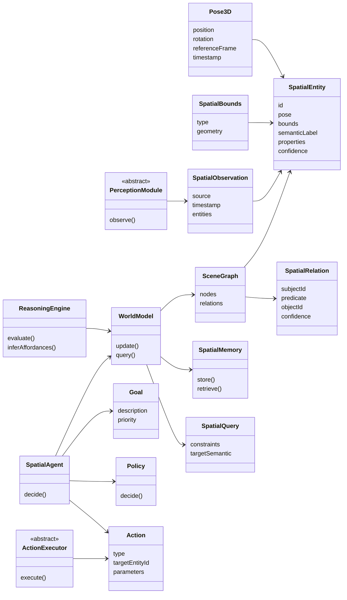

# OpenSpatialAI – Class & Flow Diagrams

This document defines the **core architecture of OpenSpatialAI**.
It is the **single source of truth** for how the system is structured and how it runs.

All contributors should refer to this file before implementing or modifying code.

---

## Architectural Overview

OpenSpatialAI is built as a **closed-loop spatial intelligence system**:

**Perception → World Model → Reasoning → Agent → Action → Feedback**

The architecture is:
- engine-agnostic
- OpenXR-aligned
- suitable for XR, robotics, and simulation
- cleanly separable into core logic and platform adapters

---

## 1. Core Class Diagram

This class diagram shows the **stable core abstractions** of OpenSpatialAI.
Platform- or SDK-specific implementations must adapt to these interfaces.



## 2. Runtime Flow Diagram

```mermaid
flowchart LR

    %% Sensors / Platform Input
    Sensors[Platform Sensors\n(OpenXR · ARKit · ROS · Simulation)]

    %% Perception
    Perception[PerceptionModule\nobserve()]
    Observation[SpatialObservation]

    %% World Model
    WorldModel[WorldModel\nupdate()]
    SceneGraph[SceneGraph]
    Memory[SpatialMemory]

    %% Reasoning
    Query[SpatialQuery]
    Reasoning[ReasoningEngine]

    %% Agent
    Agent[SpatialAgent\ndecide()]
    Goals[Goals]
    Policy[Policy]

    %% Action
    Action[Action]
    Executor[ActionExecutor\nexecute()]

    Sensors --> Perception
    Perception --> Observation

    Observation --> WorldModel
    WorldModel --> SceneGraph
    WorldModel --> Memory

    SceneGraph --> Reasoning
    Query --> Reasoning

    Reasoning --> Agent
    Goals --> Agent
    Policy --> Agent

    Agent --> Action
    Action --> Executor

    Executor --> Sensors

```